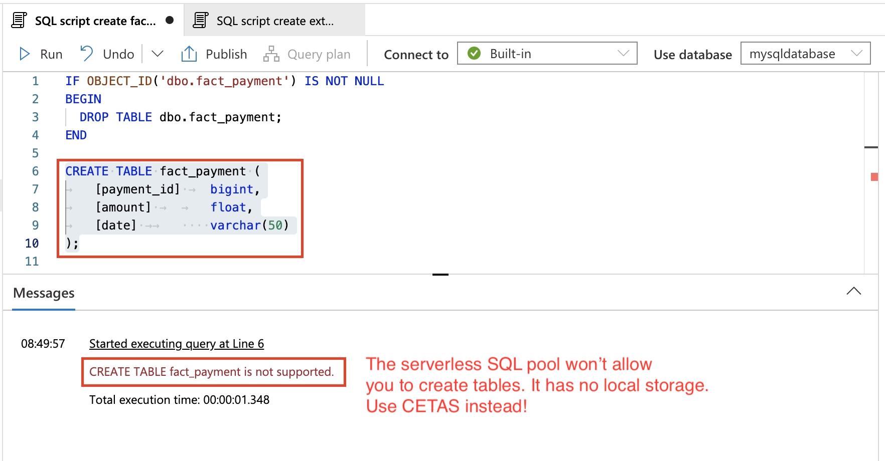
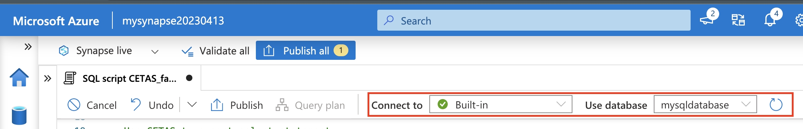
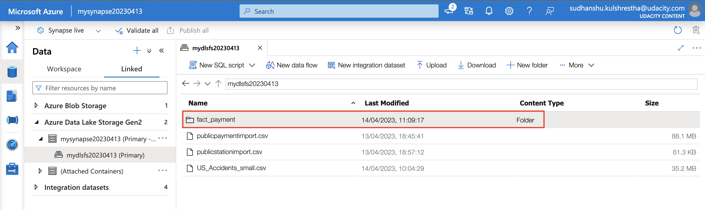

<!-- TOC -->
* [Project instructions](#project-instructions)
  * [Task 1: Create your Azure resources](#task-1--create-your-azure-resources)
      * [Task 1 Solution](#task-1-solution)
  * [Task 2: Design a star schema](#task-2--design-a-star-schema)
      * [Task 2 Solution](#task-2-solution)
  * [Task 3: Create the data in PostgreSQL](#task-3--create-the-data-in-postgresql)
      * [Task 3 Solution](#task-3-solution)
  * [Task 4: EXTRACT the data from PostgreSQL](#task-4--extract-the-data-from-postgresql)
      * [Task 4 Solution](#task-4-solution)
* [Task 5: LOAD the data into external tables in the data warehouse](#task-5--load-the-data-into-external-tables-in-the-data-warehouse)
      * [Task 5 Solution](#task-5-solution)
* [Task 6: TRANSFORM the data to the star schema using CETAS](#task-6--transform-the-data-to-the-star-schema-using-cetas)
      * [Task 6 Solution](#task-6-solution)
  * [Reference](#reference)
<!-- TOC -->

# Project instructions

To demonstrate the things you have learned in this course, you will perform the tasks outlined below. As you complete each task, you'll collect deliverables for your project submission.

## Task 1: Create your Azure resources

- Create an Azure Database for PostgreSQL. 
- Create an Azure Synapse workspace. Note that if you've previously created a Synapse Workspace, you do not need to create a second one specifically for the project. 
- Use the built-in serverless SQL pool and database within the Synapse workspace

> In the cloud lab Azure environment, you will only be able to use the built-in serverless SQL Pool.

#### [Task 1 Solution](./solutions/Task1.md)

## Task 2: Design a star schema

You are being provided a relational schema that describes the data as it exists in PostgreSQL. In addition, you have been given a set of business requirements related to the data warehouse. You are being asked to design a star schema using fact and dimension tables.

#### [Task 2 Solution](./solutions/Task2.md)

## Task 3: Create the data in PostgreSQL

To prepare your environment for this project, you first must create the data in PostgreSQL. This will simulate the production environment where the data is being used in the OLTP system. This can be done using the Python script provided for you in Github: ProjectDataToPostgres.py

- Download the script file and place it in a folder where you can run a Python script
- Download the data files from the classroom resources
- Open the script file in VS Code and add the host, username, and password information for your PostgreSQL database 
- Run the script and verify that all four data files are copied/uploaded into PostgreSQL

You can verify this data exists by using pgAdmin or a similar PostgreSQL data tool.

#### [Task 3 Solution](./solutions/Task3.md)

## Task 4: EXTRACT the data from PostgreSQL

In your Azure Synapse workspace, you will use the ingest wizard to create a one-time pipeline that ingests the data from PostgreSQL into Azure Blob Storage. This will result in all four tables being represented as text files in Blob Storage, ready for loading into the data warehouse.

#### [Task 4 Solution](./solutions/Task4.md)

# Task 5: LOAD the data into external tables in the data warehouse

Once in Blob storage, the files will be shown in the data lake node in the Synapse Workspace. From here, you can use the script-generating function to load the data from blob storage into external staging tables in the data warehouse you created using the serverless SQL Pool.
Helpful Hints

- When you use the ingest wizard, it uses the copy tool to EXTRACT into Blob storage. During this process, Azure Synapse automatically creates links for the data lake. When you start the SQL script wizard to LOAD data into external tables, start the wizard from the data lake node, not the blob storage node. 
- When using the external table wizard, you may need to modify the script to put dates into a varchar field in staging rather than using the datetime data type. You can convert them during the transform step. 
- When using the external table wizard, if you rename the columns in your script, it will help you when writing transform scripts. By default, they are named [C1], [C2], etc. which are not useful column names in staging.

#### [Task 5 Solution](./solutions/Task5.md)

# Task 6: TRANSFORM the data to the star schema using CETAS

Write SQL scripts to transform the data from the staging tables to the final star schema you designed.

The serverless SQL pool won't allow you to create persistent tables in the database, as it has no local storage. So, use CREATE EXTERNAL TABLE AS SELECT (CETAS) instead. CETAS is a parallel operation that creates external table metadata and exports the SELECT query results to a set of files in your storage account.

> Tip: For creating fact tables out of join between dimensions and staging tables, you can use CETAS to materialize joined reference tables to a new file and then join to this single external table in subsequent queries.




Create a new SQL script, and ensure you are connected to the serverless SQL pool and your SQL database.



We will rely on external tables, created in the previous LOAD step, as the source for CETAS. Assuming you have the staging external tables ready, use the syntax below to define the CETAS.

1. Define the file format, if not already. You don't have run this query for each CETAS.

```SQL
-- Use the same file format as used for creating the External Tables during the LOAD step.
IF NOT EXISTS (SELECT * FROM sys.external_file_formats WHERE name = 'SynapseDelimitedTextFormat') 
    CREATE EXTERNAL FILE FORMAT [SynapseDelimitedTextFormat] 
    WITH ( FORMAT_TYPE = DELIMITEDTEXT ,
           FORMAT_OPTIONS (
             FIELD_TERMINATOR = ',',
             USE_TYPE_DEFAULT = FALSE
            ))
GO
```

In this snippet, the file format is being defined for reading in the data from a comma delimited file stored in blob storage. Note - The script above is for reference only. It was autogenerated during the LOAD step, when we created the External tables from the Blob storage. Therefore, use the one auto-generated for you.

2. Define the data source to persist the results.

```SQL
-- Use the same data source as used for creating the External Tables during the LOAD step.
-- Storage path where the result set will persist
IF NOT EXISTS (SELECT * FROM sys.external_data_sources WHERE name = 'mydlsfs20230413_mydls20230413_dfs_core_windows_net') 
    CREATE EXTERNAL DATA SOURCE [mydlsfs20230413_mydls20230413_dfs_core_windows_net] 
    WITH (
        LOCATION = 'abfss://mydlsfs20230413@mydls20230413.dfs.core.windows.net' 
    )
GO
```

In this snippet, the external data source is being created in SQL so the data can be read directly into an external table. Use the blob storage account name as applicable to you. The script above was autogenerated during the LOAD step, when we created the External tables from the Blob storage.

3. Use CETAS to export select statement. ```sql IF OBJECT_ID('dbo.fact_payment') IS NOT NULL BEGIN DROP EXTERNAL TABLE [dbo].[fact_payment]; END

```SQL
CREATE EXTERNAL TABLE dbo.fact_payment
WITH (
    LOCATION     = 'fact_payment',
    DATA_SOURCE = [mydlsfs20230413_mydls20230413_dfs_core_windows_net],
    FILE_FORMAT = [SynapseDelimitedTextFormat]
)  
AS
SELECT [payment_id], [amount], [date]
FROM [dbo].[staging_payment];
GO
```

The query above will read the data from dbo.staging_payment external table, and persist the results in the fact_payment/ directory as CSV format.


4. Finally, query the newly created CETAS external table, and ensure you get the desired output.

```SQL
SELECT TOP 100 * FROM dbo.fact_payment
GO
```
You can also explore the Linked data source to verify the results.



#### [Task 6 Solution](./solutions/Task6.md)

## Reference
- [CETAS in serverless SQL pool](https://learn.microsoft.com/en-us/azure/synapse-analytics/sql/develop-tables-cetas#cetas-in-serverless-sql-pool)
- [How to use CETAS on serverless SQL pool](https://techcommunity.microsoft.com/t5/azure-synapse-analytics-blog/how-to-use-cetas-on-serverless-sql-pool-to-improve-performance/ba-p/3548040)
- [Best practices for serverless SQL pool in Azure Synapse Analytics](https://learn.microsoft.com/en-us/azure/synapse-analytics/sql/best-practices-serverless-sql-pool)


