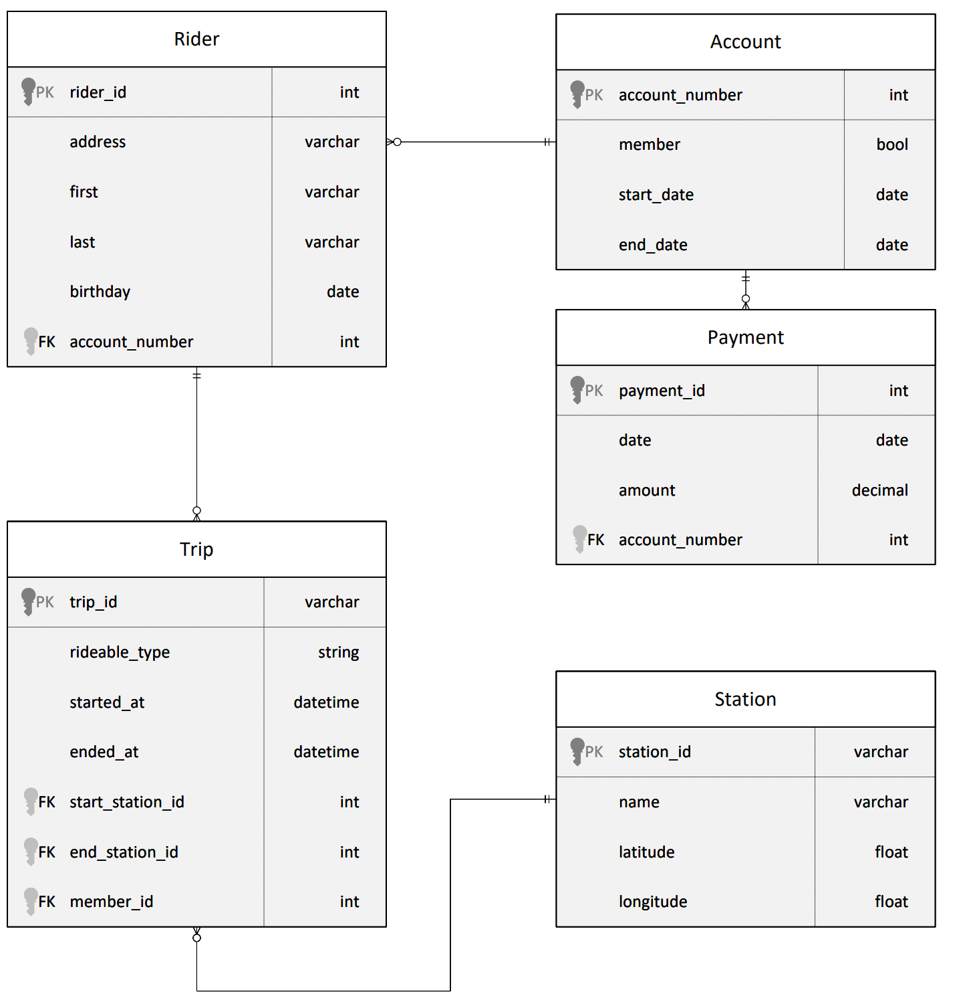

- [Task 2: Design a star schema](#task-2-design-a-star-schema)
  - [Evaluation criteria](#evaluation-criteria)
  - [Guide](#guide)


# [Task 2: Design a star schema](../Project%20Instructions.md#task-2--design-a-star-schema)

## Evaluation criteria


## Guide
We have to transform relational-database schema to OLTP-suitable star-schema.
Star schema splits tables into fact-tables (or "events" like payment, trip) and dimension-tables (like date, rider or station).
The design should take into account [future queries](../Project%20Overview.md).



Creating database diagrams is convenient using https://dbdiagram.io/.

The resulting schema can look smth like this ([OLTP_schema.pdf](../assets/oltp_schema.pdf)):

```
Table fact_trip {
  trip_id bigint [primary key]
  rider_id bigint 
  station_start_id nvarchar(4000)
  station_end_id nvarchar(4000)
  duration_minutes bigint
  date_start_id varbinary
  date_end_id varbinary
}

Table fact_payment {
  payment_id bigint [primary key]
  date_id varbinary
  rider_id bigint
  amount money
}

Table dim_rider {
  rider_id bigint [primary key]
  address nvarchar(4000)
  first_name nvarchar(4000)
  last_name nvarchar(4000)
  birthday datetime2(0) 
  age_start_account int
  account_start_date datetime2(0)
  accound_end_date datetime2(0) 
  is_member bit
  total_payed money
  total_duration_minutes int
}


Table dim_date {
  date_id varbinary [primary key]
  date datetime2(0)
  year int
  quater int
  month int 
  day int
  weekday int
}

Table dim_station{
  station_id nvarchar(4000)
  station_name nvarchar(4000)
}

Ref: fact_trip.rider_id > dim_rider.rider_id 


Ref: fact_payment.rider_id > dim_rider.rider_id 


Ref: fact_payment.date_id > dim_date.date_id 

Ref: fact_trip.station_start_id - dim_station.station_id 
Ref: fact_trip.station_end_id - dim_station.station_id 
```

# [Task 1](./Task1.md) | [Task 3](./Task3.md)