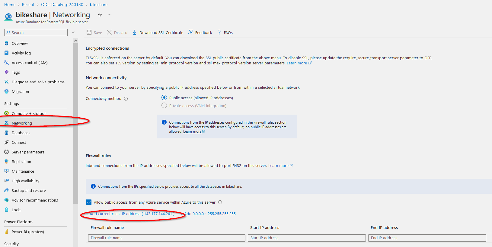

- [Task 3: Create the data in PostgreSQL](#task-3-create-the-data-in-postgresql)
  - [Guide](#guide)
    - [Upload the data to the PostgreSQL using Python script](#upload-the-data-to-the-postgresql-using-python-script)
- [Task 2 | Task 4](#task-2--task-4)


# [Task 3: Create the data in PostgreSQL](../Project%20Instructions.md#task-3--create-the-data-in-postgresql)


## Guide

### Upload the data to the PostgreSQL using Python script

First go to the PostgreSQL resource created in [Task 1](./Task1.md). On the networing page add your client's IP address to the list of firewall rules. Then press **Save**.



Modify (fill in the right **host**, **user** and **password**) [ProjectDataToPostgres.py](../src/ProjectDataToPostgres.py) from your local Python environment. **host** is mentioned on the **Overview** page, **user** and **password** as you filled them wheb creating the resource.

Put project .csv files (4 tables) into *./data/* folder (check the script to make sure it will find the data).

Run the script:
```
cd '.\Project1 Bikeshare data analytics\src\'
python '.\ProjectDataToPostgres.py'
cd ..
```


# [Task 2](./Task2.md) | [Task 4](./Task4.md)