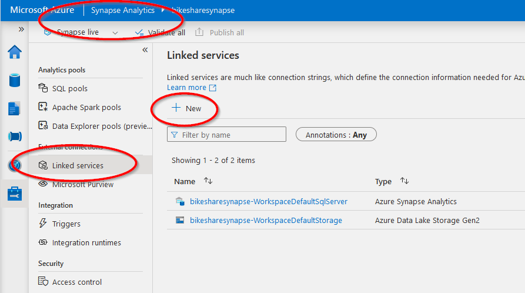

- [Task 4: EXTRACT the data from PostgreSQL](#task-4-extract-the-data-from-postgresql)
  - [Evaluation criteria](#evaluation-criteria)
  - [Guide](#guide)
    - [Link Synapse to PostgreSQL](#link-synapse-to-postgresql)
    - [Link Synapse to Blob Storage](#link-synapse-to-blob-storage)
    - [Extract data from Postgres into the Blob storage](#extract-data-from-postgres-into-the-blob-storage)
  - [Deliverable](#deliverable)
- [Task 3 | Task 5](#task-3--task-5)

# [Task 4: EXTRACT the data from PostgreSQL](../Project%20Instructions.md#task-4--extract-the-data-from-postgresql)

## Evaluation criteria

## Guide

### Link Synapse to PostgreSQL

Go to Synapse workspace and then **Manage** >> **Linked services** >> New. 

Find Azure Database for PostgreSQL in the list.   

### Link Synapse to Blob Storage
Similarly create a linked service to the [Blob storage account](./Task1.md#creat-a-blob-storage)
> Note: link to the Blob storage, not the Gen2 storage account created together with Synapse.

### Extract data from Postgres into the Blob storage
From the Synapsis home screen select **Ingest**.

Select destination:

When succeded go to the Blob storage and make a screenshot of 4 text files for the deliverable.

## Deliverable

# [Task 3](./Task3.md) | [Task 5](./Task5.md)