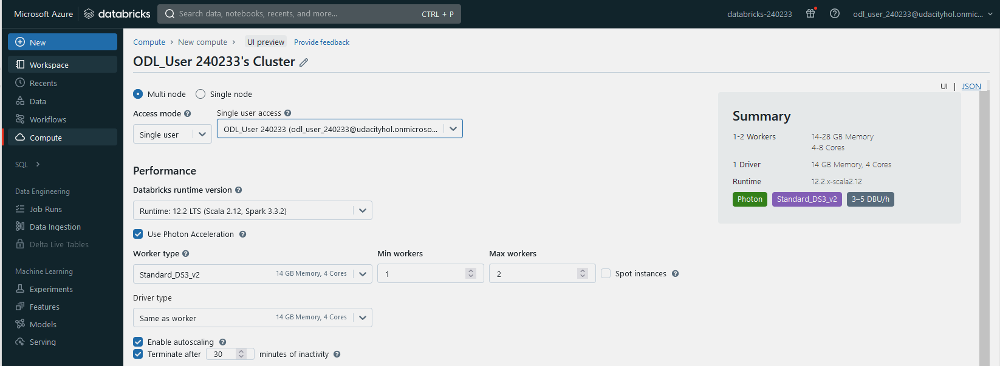
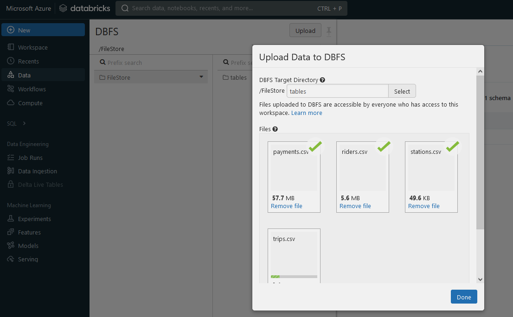
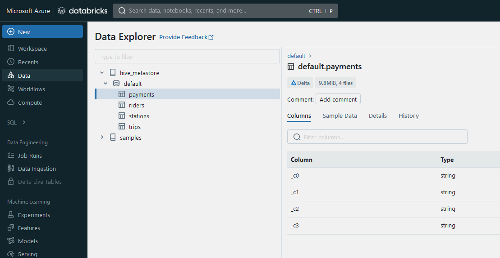

- [Task 2: Extract Step](#task-2-extract-step)
  - [Evaluation Criteria](#evaluation-criteria)
  - [Guide](#guide)
    - [Enable "DBFS File Browser"](#enable-dbfs-file-browser)
    - [Create a cluster](#create-a-cluster)
    - [Upload data files into Databricks](#upload-data-files-into-databricks)
    - [Load data into Datbricks as dataframes](#load-data-into-datbricks-as-dataframes)
    - [Write data into data lake](#write-data-into-data-lake)
  - [Deliverables](#deliverables)
- [Task 1 | Task 3](#task-1--task-3)

# Task 2: Extract Step

## Evaluation Criteria


## Guide

### Enable "DBFS File Browser" 
Databricks >> Admin Console >> Admin Settings

### Create a cluster


### Upload data files into Databricks


### Load data into Datbricks as dataframes

```
df_payments = spark.read.format("csv").option("sep",",").load("/FileStore/tables/payments.csv")
df_riders = spark.read.format("csv").option("sep",",").load("/FileStore/tables/riders.csv")
df_stations = spark.read.format("csv").option("sep",",").load("/FileStore/tables/stations.csv")
df_trips = spark.read.format("csv").option("sep",",").load("/FileStore/tables/trips.csv")
```

### Write data into data lake
```
df_payments.write.format("delta").mode("overwrite").saveAsTable("payments")
df_riders.write.format("delta").mode("overwrite").saveAsTable("riders")
df_stations.write.format("delta").mode("overwrite").saveAsTable("stations")
df_trips.write.format("delta").mode("overwrite").saveAsTable("trips")
```

Double-check the tables are written into the data lake:   
  


## Deliverables

[EXTRACT.ipynb](../src/Task2%20Extract/EXTRACT.ipynb)


# [Task 1](./Task1.md) | [Task 3](./Task3.md)