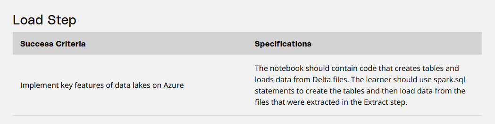

- [Task 3: Load Step](#task-3-load-step)
  - [Evaluation Criteria](#evaluation-criteria)
  - [Guide](#guide)
    - [Create tables according to the relational schema using delta lake data](#create-tables-according-to-the-relational-schema-using-delta-lake-data)
- [Deliverables](#deliverables)
- [Task 2 | Task 4](#task-2--task-4)

# Task 3: Load Step

## Evaluation Criteria
  


## Guide

### Create tables according to the relational schema using delta lake data

```
spark.sql("""
    CREATE OR REPLACE TABLE payments (
        payment_id BIGINT,
        `date` TIMESTAMP,
        amount FLOAT,
        rider_id BIGINT
    ) 
    USING DELTA 
    LOCATION "delta/payments"
"""
)

spark.sql("""
    CREATE OR REPLACE TABLE station (
        station_id BIGINT,
        name STRING,
        latitude FLOAT,
        longitude FLOAT
    ) 
    USING DELTA 
    LOCATION "delta/station"
"""
)

spark.sql("""
    CREATE OR REPLACE TABLE rider (
        trip_id BIGINT,
        `first` VARCHAR(50),
        `last` VARCHAR(50),
        address VARCHAR(50),
        birthday TIMESTAMP,
        account_start_date TIMESTAMP,
        account_end_date TIMESTAMP,
        is_member BOOLEAN
    ) 
    USING DELTA 
    LOCATION "delta/rider"
"""
)

spark.sql("""
    CREATE OR REPLACE TABLE trip (
        trip_id BIGINT,
        rideable_type STRING,
        started_at TIMESTAMP,
        ended_at TIMESTAMP,
        start_station_id BIGINT,
        end_station_id BIGINT,
        rider_id BIGINT
    ) 
    USING DELTA 
    LOCATION "delta/trip"
"""
)

```


# Deliverables

[LOAD.ipynb](../src/Task3%20Load/LOAD.ipynb)


# [Task 2](./Task2.md) | [Task 4](./Task4.md)