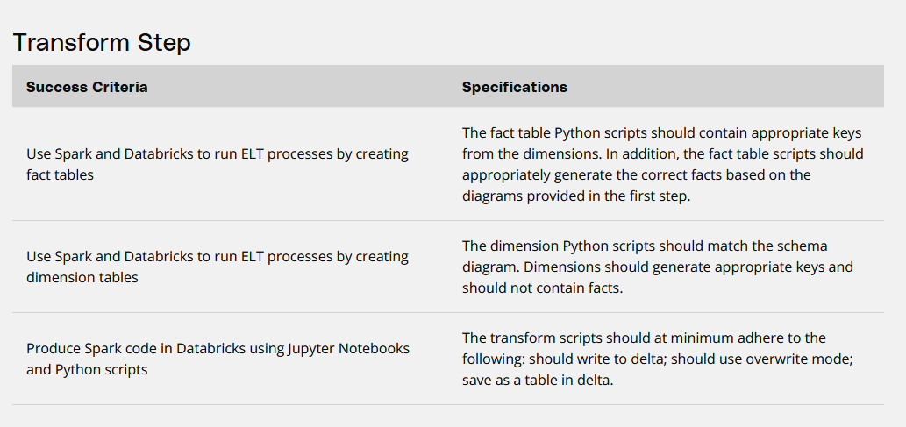

- [Task 4: Transform](#task-4-transform)
  - [Evaluation Criteria](#evaluation-criteria)
  - [Guide](#guide)
- [Deliverables](#deliverables)
- [Task 3 |](#task-3-)

# Task 4: Transform

## Evaluation Criteria
  

## Guide
Read relational tables created in [Task 3](./Task3.md) into spark, perform transformations according to your desired schema from [Task 1](./Task1.md) and store the resulting fact- and dimentional-tables.

Example:

```python
df_payment = spark.read.table("payment")
dim_date = df_payment.select(
    md5(concat_ws("", df_payment["date"].cast("string"))).alias("date_id"),
    df_payment["date"],
    year("date").alias("year"),
    ((month("date") + 2) / 3).cast("int").alias("quarter"),
    month("date").alias("month"),
    dayofmonth("date").alias("day"),
    dayofweek("date").alias("weekday")
)

dim_date.write.format("delta").mode("overwrite").saveAsTable("dim_date")
```

# Deliverables

[TRANSFORM.ipynb](../src/Task4%20Tranform/TRANFORM.ipynb)

# [Task 3](./Task3.md) | 